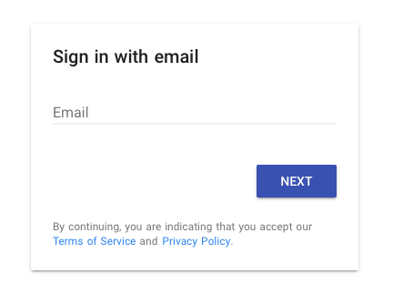

# Nuxt & Firebase-Auth-Email-Link Sample

## Create firebase.config.json file.

``` bash
# Save as firebase.config.json file to project root directory.
{
   "apiKey": "Your API key",
   "authDomain": "Your domain",
   "databaseURL": "Your URL",
   "projectId": "Your project ID",
   "storageBucket": "Your bucket",
   "messagingSenderId": "Your messaging sender ID"
 }
```

## Build Setup

``` bash
# install dependencies
$ npm install

# serve with hot reload at localhost:3000
$ npm run dev
```

## Open localhost:3000
